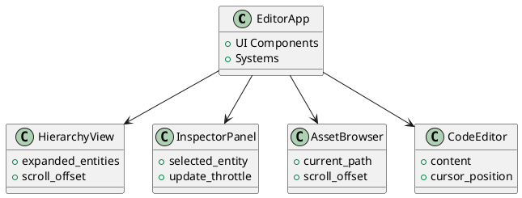
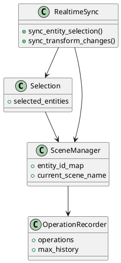

# コンポーネント図

Adbx Engine Editorの主要コンポーネントの関係を説明します。

## UIコンポーネント階層

```plantuml
@startuml
class EditorApp {
    + UI Components
    + Systems
}

class HierarchyView {
    + expanded_entities
    + scroll_offset
}

class InspectorPanel {
    + selected_entity
    + update_throttle
}

class AssetBrowser {
    + current_path
    + scroll_offset
}

class CodeEditor {
    + content
    + cursor_position
}

EditorApp --> HierarchyView
EditorApp --> InspectorPanel
EditorApp --> AssetBrowser
EditorApp --> CodeEditor
@enduml
```

## システム依存関係

```plantuml
@startuml
class Selection {
    + selected_entities
}

class SceneManager {
    + entity_id_map
    + current_scene_name
}

class OperationRecorder {
    + operations
    + max_history
}

class RealtimeSync {
    + sync_entity_selection()
    + sync_transform_changes()
}

Selection --> SceneManager
SceneManager --> OperationRecorder
RealtimeSync --> Selection
RealtimeSync --> SceneManager
@enduml
```

## 関連ドキュメント

- [システム概要](system-overview.md)
- [データフロー図](data-flow.md)
