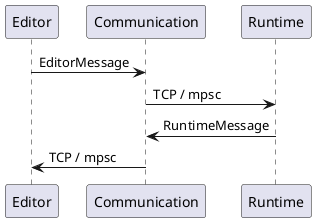
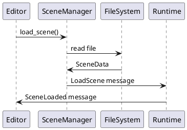
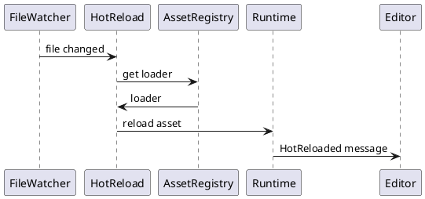

# データフロー図

Adbx Engine Editorの主要なデータフローを説明します。

## エディタ-ランタイム通信フロー

```plantuml
@startuml
participant Editor
participant Communication
participant Runtime

Editor -> Communication: EditorMessage
Communication -> Runtime: TCP / mpsc
Runtime -> Communication: RuntimeMessage
Communication -> Editor: TCP / mpsc
@enduml
```

## シーン読み込み/保存フロー

```plantuml
@startuml
participant Editor
participant SceneManager
participant FileSystem
participant Runtime

Editor -> SceneManager: load_scene()
SceneManager -> FileSystem: read file
FileSystem -> SceneManager: SceneData
SceneManager -> Runtime: LoadScene message
Runtime -> Editor: SceneLoaded message
@enduml
```

## ホットリロードフロー

```plantuml
@startuml
participant FileWatcher
participant HotReload
participant AssetRegistry
participant Runtime

FileWatcher -> HotReload: file changed
HotReload -> AssetRegistry: get loader
AssetRegistry -> HotReload: loader
HotReload -> Runtime: reload asset
Runtime -> Editor: HotReloaded message
@enduml
```

## 関連ドキュメント

- [システム概要](system-overview.md)
- [コンポーネント図](component-diagram.md)
